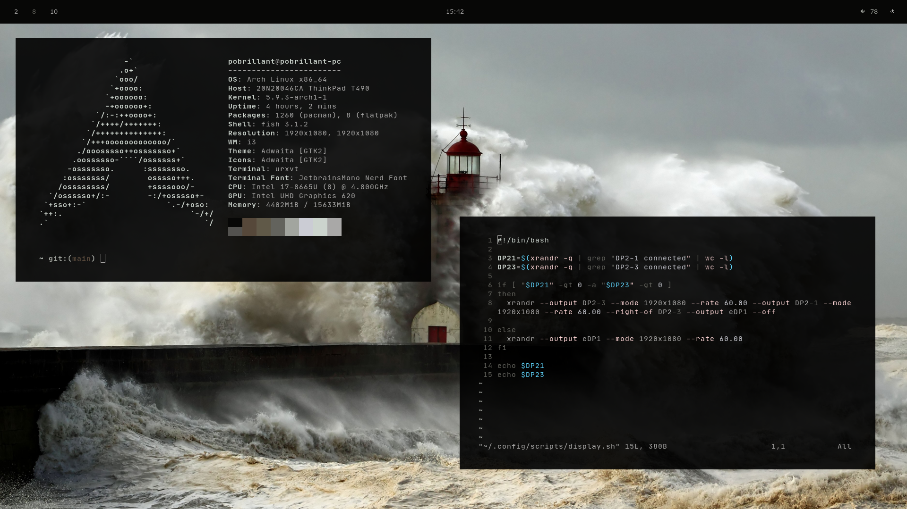

# rice

Configuration de mon environnement linux personnel.

## Outils utilisés

### i3-gaps

Gestionnaire de fenêtre relativement facile à installer, supportant des marges entre les différentes fenêtre pour afficher élégament l'agencement de plusieurs fenêtres et l'arrière plan.

### rofi

Menu servant à lancer les application. Peut être lancé avec Super+d.

### polybar

Barre de statut extensible permettant principalement de gérer les différents environnements virtuels.

### pywall

Outil de gestion des arrières plans. Utilise les couleurs d'une image pour définir les couleurs de l'environnement.

### Alacritty (Non utilisé)

Supposément le terminal le plus rapide à l'affichage puisqu'il utilise l'accélération graphique. Ça ne semble pas être le plus rapide à lancer.
J'utilises maintenant urxvt, mais je conserve la configuration au cas où.

### rxvt-unicode (urxvt)

Terminal que j'utilises. C'est le terminal qui se lance le plus rapidement, et il utilise directement les couleurs du système.

### fish

Shell facilement personnalisable et assez rapide.

### compton

Compositeur pour X.

### razer-cli

J'utilise une souris razer. Ses couleurs vont s'adapter à partir de celles choisies par pywall.

## Polices

Plusieurs policies sont utilisées à différents endroits dans les fichiers de configuation.

- Jetbrains Mono

## Icônes

- Papirus

## Notes supplémentaires

### Lancement du gestionnaire de fenêtres

.xinitrc n'est pas présent puisque j'utilises gdm pour démarer mes environnements.

## Images

  

